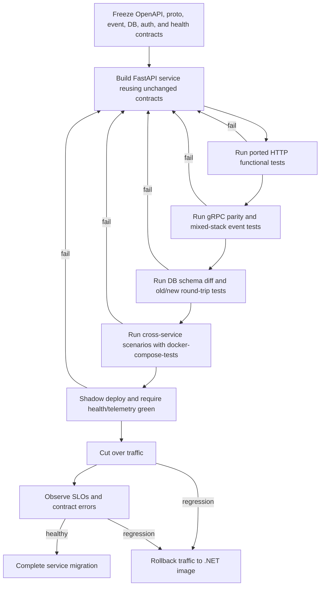

# Devin Prompt: Incrementally Modernize eShopOnContainers

You are Devin. Modernize this repository from its .NET Core 3.1/Angular 8 implementation to an incrementally deployable Python FastAPI backend and a modern Angular frontend. Work autonomously, inspect the repository before every phase, keep changes reviewable, and do not stop at a design document: implement, test, containerize, and prepare each migration slice for production cutover.

**Baseline anchor:** execute this prompt against the repository's .NET Core 3.1/Angular 8 baseline on `origin/main` (verified at commit `31ab9b62b9fb02fb1c1eb7cadef285c5e6ca6731`). Do not execute it against the divergent `dev` line, whose newer tree no longer contains all services and contracts covered here. If `origin/main` has moved, locate the equivalent revision and prove the inventory below before changing code.

Two decisions are already made and are not open for reconsideration:

1. **Frontend: Option A — modernize the existing Angular application in place. Do not rewrite it in React.**
2. **Identity: use an external OIDC Identity Provider, preferably Keycloak 26.x or Ory Hydra. Do not reimplement IdentityServer4 in Python.**

The Python and TypeScript versions in this prompt are recommended pins. Confirm compatible current releases at installation time, record any justified adjustment, and pin the resolved versions reproducibly. Validate the SQL Server `aioodbc` plus Microsoft ODBC Driver 18 asynchronous path first; it is the most fragile technical dependency in this plan.

## 0. Objective

Incrementally migrate backend microservices from .NET Core 3.1 (`netcoreapp3.1`) to Python FastAPI and modernize the Angular 8 frontend to modern Angular without breaking externally observable behavior.

Use a strangler-fig migration:

- Migrate one service at a time.
- Keep every un-migrated .NET service running beside migrated Python services.
- Keep the stack runnable under Docker Compose after every slice.
- Preserve identical HTTP, gRPC, integration-event, authentication, health-check, and shared-database contracts.
- Route traffic to a Python replacement only after its frozen-contract gate passes.
- Retain a one-step rollback to the previous .NET image until the replacement is proven in production.
- Do not combine a service migration with unrelated architecture changes.

Before changing code, reproduce the current stack and create a migration ledger listing every service, owner path, contract snapshot, test suite, current image, replacement image, cutover status, and rollback command.

## 1. Governing principle: frozen contracts are non-negotiable

For **each service**, complete these steps before implementing its replacement:

1. Run the .NET service and save its OpenAPI document from `/swagger/v1/swagger.json`.
2. Copy and checksum every `.proto` contract used by that service.
3. Generate golden JSON examples and JSON Schemas for every produced or consumed integration event.
4. Dump its database schema, including schemas, tables, columns, types, lengths, precision, nullability, defaults, keys, indexes, foreign keys, constraints, sequences, and delete behavior.
5. Record authentication requirements, JWT authority/audience, status codes, headers, content types, route constraints, pagination behavior, and health responses.
6. Commit the artifacts and executable comparison tests before replacement work starts.

Passing these frozen contracts is the merge and cutover gate. During migration, do not change:

- route templates or HTTP methods;
- route constraints;
- query-parameter or header names;
- request or response JSON field names, casing, types, nullability, defaults, or status codes;
- OpenAPI operation behavior;
- protobuf packages, services, RPCs, messages, field names, field numbers, types, optionality, or status codes;
- integration-event class names, routing keys, property names, casing, types, or serialization;
- database schemas, table/column/index/constraint/sequence names, types, relationships, or delete behavior;
- existing Compose service names, externally exposed ports, internal ports, or environment-variable interfaces.

If FastAPI's default OpenAPI or validation behavior differs from ASP.NET Core, customize FastAPI's OpenAPI generation, exception handlers, response serialization, and routing until the frozen result matches. Do not weaken the golden tests to accommodate the replacement.

## 2. Current-state inventory

Re-verify this inventory against the checked-out revision before implementation. The paths and contracts below were verified against the repository's .NET Core 3.1/Angular 8 implementation.

### 2.1 Services and web applications

Backend services under `src/Services`:

- `Basket`
- `Catalog`
- `Identity`
- `Location`
- `Marketing`
- `Ordering`
  - `Ordering.API`
  - `Ordering.BackgroundTasks`
  - `Ordering.SignalrHub`
- `Payment`
- `Webhooks`

Web applications under `src/Web`:

- `WebMVC`
- `WebSPA` — Angular 8 and TypeScript
- `WebStatus`
- `WebhookClient`

### 2.2 Shared infrastructure

Event-bus building blocks under `src/BuildingBlocks/EventBus`:

- `EventBus`
- `EventBusRabbitMQ`
- `EventBusServiceBus`
- `IntegrationEventLogEF`

API gateways and BFFs under `src/ApiGateways`:

- Envoy gateway projects route external HTTP paths.
- C# `HttpAggregator` projects compose responses and call Basket, Catalog, and Ordering through gRPC.
- `Web.Bff.Shopping/aggregator` is a representative aggregator.
- Preserve this Envoy-to-aggregator-to-gRPC relationship while individual services are replaced. Port the C# aggregators only if the end state requires a fully Python backend.

### 2.3 Existing tests and orchestration

Use, port, and extend tests found in:

- `src/Tests/Services/Application.FunctionalTests`
- per-service `*.FunctionalTests`
- per-service `*.UnitTests`

Treat these Compose files as required deployment and test contracts:

- `src/docker-compose.yml`
- `src/docker-compose.override.yml`
- `src/docker-compose-tests.yml`
- `src/docker-compose-tests.override.yml`

The test topology uses SQL Server 2017, MongoDB, Redis, and RabbitMQ. The development topology uses service DNS names, fixed HTTP/gRPC ports, gateway routes, health URLs, and environment variables that replacements must continue to accept.

### 2.4 Verified foundational contracts

- Integration events derive from a base carrying `Id` as a GUID and `CreationDate` as a UTC timestamp.
- RabbitMQ uses the direct exchange `eshop_event_bus`.
- The RabbitMQ routing key is the integration-event class name.
- Azure Service Bus uses the event class name without the trailing `IntegrationEvent` suffix as the message Label/Subject and subscription correlation-filter value.
- Messages are serialized with Newtonsoft.Json and published as persistent messages.
- The EF integration-event log implements a transactional outbox with states `NotPublished`, `InProgress`, `Published`, and `PublishedFailed`.
- Consumers must tolerate at-least-once delivery. The reference primarily relies on naturally idempotent operations, monotonic aggregate transitions, and command-level `x-requestid` handling rather than a general event-`Id` inbox.
- BFFs and `WebStatus` poll `/hc`.
- `/liveness` is a self-only check.
- `/hc` must retain the exact JSON shape emitted by `UIResponseWriter.WriteHealthCheckUIResponse`; capture a golden response rather than approximating it.

## 3. Shared Python foundation

Create a reusable package such as `src/python/eshop_common`. Every migrated Python service must consume it rather than implementing incompatible local copies.

### 3.1 Technology mapping

| Concern | Python replacement |
| --- | --- |
| Runtime | CPython `3.12.x` |
| HTTP API | `fastapi>=0.115`, `uvicorn[standard]>=0.32` |
| Models/validation | `pydantic>=2.9` |
| OpenAPI | FastAPI built-in OpenAPI, exposed exactly at `/swagger/v1/swagger.json` |
| Structured logging | `structlog>=24.4` |
| Dependency injection | FastAPI `Depends`; use `dependency-injector>=4.42` where a container is useful |
| Resilience | `tenacity>=9.0` |
| Telemetry | `opentelemetry-sdk>=1.27`, `azure-monitor-opentelemetry` |
| gRPC | `grpcio>=1.66`, `grpcio-tools>=1.66` |
| RabbitMQ | `aio-pika>=9.4` |
| Azure Service Bus | `azure-servicebus>=7.12` |
| Relational persistence/outbox | `sqlalchemy>=2.0`, `alembic>=1.13` |
| SQL Server async driver | `aioodbc>=0.5`, `pyodbc>=5.1`, Microsoft ODBC Driver 18 |
| Blob storage | `azure-storage-blob>=12.23` |
| Redis | `redis>=5.1` |
| JWT | `pyjwt[crypto]>=2.9` |
| CQRS dispatcher | `mediatr>=1.3` or a small typed in-repository dispatcher |
| MongoDB | `motor>=3.6`, `pymongo>=4.9`; optionally `beanie>=1.27` |
| HTTP client | `httpx>=0.27` |
| Realtime notifications | `python-socketio>=5.11` or FastAPI WebSockets plus a maintained broadcaster |

### 3.2 Required shared capabilities

Implement and test:

1. **Configuration**
   - Accept the existing environment-variable names unchanged, including differences in historical casing such as `identityUrl` and `IdentityUrl`.
   - Support local Compose service DNS names and external public URLs.
   - Fail fast with a redacted, actionable error for missing required configuration.

2. **Event bus**
   - Provide RabbitMQ and Azure Service Bus adapters behind one typed interface.
   - For RabbitMQ, publish to direct exchange `eshop_event_bus` with `routing_key = event class name`.
   - For Azure Service Bus, set the message Label/Subject to the class name with the trailing `IntegrationEvent` suffix removed, create per-event subscription rules with a correlation filter on that value, and re-append `IntegrationEvent` when resolving the .NET-compatible event type on receipt.
   - Match Newtonsoft.Json output, including property casing, GUID text, decimal/number representation, null handling, array/object layout, and UTC `CreationDate`.
   - Include the base `Id` and `CreationDate` exactly.
   - Mark RabbitMQ messages persistent.
   - Preserve retry and reconnect behavior without causing duplicate side effects.

3. **Transactional outbox**
   - Write domain data and the outbox entry in the same SQL transaction.
   - Preserve the existing `IntegrationEventLog` schema and lifecycle where sharing an existing database.
   - Publish asynchronously and track attempts/failures.
   - Make duplicate delivery produce no additional side effects. Preserve natural/aggregate and `x-requestid` idempotency, and add an event-`Id` inbox/deduplication mechanism where necessary without changing the external event contract.

4. **Health checks**
   - Serve `/liveness` with self checks only.
   - Serve `/hc` with all dependencies and the exact captured `UIResponseWriter.WriteHealthCheckUIResponse` body, content type, and status behavior.
   - Add adapters for SQL Server, MongoDB, Redis, RabbitMQ/Azure Service Bus, and external HTTP dependencies.

5. **Authentication**
   - Validate bearer tokens from the external IdP through its OIDC discovery document and rotating JWKS.
   - Validate issuer, signature, expiration, not-before, and the service's exact audience.
   - Preserve existing audiences: `basket`, `orders`, `marketing`, `locations`, `orders.signalrhub`, `webhooks`, `mobileshoppingagg`, and `webshoppingagg`.
   - The current Catalog API is not JWT-protected and the current IdentityServer configuration does not define a `catalog` API resource. Do not make Catalog routes require authentication during a contract-preserving cutover. A `catalog` audience may be provisioned for future use only if it does not change current authorization behavior.

6. **Observability**
   - Emit structured logs with correlation/request IDs and event IDs.
   - Instrument FastAPI, HTTPX, SQLAlchemy/ODBC, Redis, MongoDB, RabbitMQ/Azure Service Bus, and gRPC.
   - Export through OpenTelemetry and support Azure Monitor through existing configuration.
   - Never log tokens, secrets, connection strings, payment data, or personal data.

7. **Service template**
   - Provide consistent application startup/shutdown, DI, configuration, exception mapping, OpenAPI customization, logging, telemetry, health checks, graceful event-consumer shutdown, and test fixtures.
   - Provide separate HTTP and gRPC listeners where the existing service uses both `PORT=80` and `GRPC_PORT=81`.

## 4. Per-service migration specifications

For every subsection below, first freeze the service's HTTP, gRPC, event, database, authentication, health, Compose, and functional-test behavior. Replace its Dockerfile with a pinned Python image while retaining the Compose service name, ports, volumes, dependencies, health URLs, and environment variables. During shadow deployment, keep both images available and make rollback a configuration-only operation.

### 4.1 Catalog — migrate first

Implement Catalog in FastAPI with SQLAlchemy/Alembic, SQL Server through `aioodbc`/`pyodbc` and ODBC Driver 18, optional Azure Blob Storage through `azure-storage-blob`, the shared outbox/event bus, and the unchanged gRPC contract.

Preserve these HTTP routes and semantics:

| Method | Route | Required behavior |
| --- | --- | --- |
| `GET` | `api/v1/catalog/items` | Query parameters `pageSize`, `pageIndex`, optional comma-separated `ids`; response fields `pageIndex`, `pageSize`, `count`, `data` |
| `GET` | `api/v1/catalog/items/{id:int}` | Preserve invalid-ID and not-found status behavior |
| `GET` | `api/v1/catalog/items/withname/{name:minlength(1)}` | Preserve pagination/query behavior |
| `GET` | `api/v1/catalog/items/type/{catalogTypeId}/brand/{catalogBrandId:int?}` | Preserve optional brand behavior |
| `GET` | `api/v1/catalog/items/type/all/brand/{catalogBrandId:int?}` | Preserve optional brand behavior |
| `GET` | `api/v1/catalog/catalogtypes` | Preserve JSON names/casing |
| `GET` | `api/v1/catalog/catalogbrands` | Preserve JSON names/casing |
| `PUT` | `api/v1/catalog/items` | Publish `ProductPriceChangedIntegrationEvent` only if the price changed; return the existing `201 CreatedAtAction` result |
| `POST` | `api/v1/catalog/items` | Return the existing `201 CreatedAtAction` result |
| `DELETE` | `api/v1/catalog/{id}` | Return `204` when deleted and `404` when absent |
| `GET` | `api/v1/catalog/items/{catalogItemId:int}/pic` | Preserve picture content/status/cache behavior |

Preserve the `PaginatedItemsViewModel<CatalogItem>` shape and every `CatalogItem`, `CatalogBrand`, and `CatalogType` field exactly.

Reuse `src/Services/Catalog/Catalog.API/Proto/catalog.proto` without edits. Implement:

- `GetItemById`, including `FailedPrecondition` for IDs `<= 0` and `NotFound` when absent;
- `GetItemsByIds`, including comma-separated ID behavior, pagination fields, and status codes.

Preserve SQL Server tables `Catalog`, `CatalogBrand`, and `CatalogType`; sequences `catalog_hilo`, `catalog_brand_hilo`, and `catalog_type_hilo`; required `Name` and `Price`; optional `PictureFileName`; brand/type relationships; defaults, precision, indexes, and seed compatibility.

Publish:

- `ProductPriceChangedIntegrationEvent` → Basket and Webhooks.
- `OrderStockConfirmedIntegrationEvent` or `OrderStockRejectedIntegrationEvent` from stock validation as currently implemented.

Consume:

- `OrderStatusChangedToAwaitingValidationIntegrationEvent`.
- `OrderStatusChangedToPaidIntegrationEvent`.

Use `Catalog.FunctionalTests`, the catalog scenarios in `Application.FunctionalTests`, and the BFF gRPC calls as compatibility oracles.

### 4.2 Basket

Implement Basket with FastAPI, async Redis (`redis>=5.1`), shared JWT validation with audience `basket`, the shared event bus, and unchanged gRPC.

Preserve:

| Method | Route | Required behavior |
| --- | --- | --- |
| `GET` | `api/v1/basket/{id}` | Authorized; return current HTTP response shape |
| `POST` | `api/v1/basket` | Authorized; update and return the basket |
| `POST` | `api/v1/basket/checkout` | Authorized; require/use `x-requestid`; preserve idempotency and status behavior |
| `DELETE` | `api/v1/basket/{id}` | Authorized; preserve existing response |

Reuse `src/Services/Basket/Basket.API/Proto/basket.proto` unchanged. Implement `GetBasketById` and `UpdateBasket` field-for-field. Missing gRPC baskets must return `NotFound`.

Publish:

- `UserCheckoutAcceptedIntegrationEvent` → Ordering.

Consume:

- `ProductPriceChangedIntegrationEvent` from Catalog and update both current and old prices exactly.
- `OrderStartedIntegrationEvent` from Ordering and delete/clear the corresponding buyer basket as currently implemented.

### 4.3 Ordering — hardest; migrate late

Preserve the DDD/CQRS behavior rather than replacing it with CRUD:

- Replace MediatR with `mediatr>=1.3` or a small typed command/query/domain-event dispatcher.
- Replace FluentValidation with Pydantic validators and map validation failures to the frozen response.
- Replace Dapper queries with SQLAlchemy Core `text()` or the `databases` package where its SQL Server support is proven compatible.
- Replace EF Core with SQLAlchemy 2 and Alembic without changing the existing schema.
- Preserve aggregate invariants, field-backed private properties, command idempotency, domain-event ordering, and integration-event publication.
- Reproduce `SaveEntitiesAsync`: dispatch domain events before the database save, while maintaining the aggregate transaction and outbox guarantees.
- Use `tenacity` only where retries are safe and preserve existing idempotency semantics.

Preserve routes under `api/v1/orders`:

| Method | Route | Required behavior |
| --- | --- | --- |
| `PUT` | `api/v1/orders/cancel` | Authorized; require/use `x-requestid`; preserve idempotency/statuses |
| `PUT` | `api/v1/orders/ship` | Authorized; require/use `x-requestid`; preserve idempotency/statuses |
| `GET` | `api/v1/orders/{orderId:int}` | Authorized; preserve not-found/result shape |
| `GET` | `api/v1/orders` | Authorized; preserve buyer filtering and summary shape |
| `GET` | `api/v1/orders/cardtypes` | Authorized; preserve fields/order |
| `POST` | `api/v1/orders/draft` | Authorized; preserve order-draft totals/items |

Reuse `src/Services/Ordering/Ordering.API/Proto/ordering.proto` unchanged and implement `CreateOrderDraftFromBasketData` field-for-field, including gRPC statuses.

Preserve SQL Server details:

- schema `ordering`;
- tables including `orders`, `orderItems`, `buyers`, `cardtypes`, `orderstatus`, `paymentmethods`, and `requests`;
- HiLo sequences `ordering.orderseq`, `ordering.buyerseq`, `ordering.paymentseq`, and `orderitemseq` in the default/`dbo` schema, with their existing increments;
- owned `Address` columns on `orders`, including names such as `Address_City`, `Address_Country`, `Address_State`, `Address_Street`, and `Address_ZipCode`;
- private/field-backed mappings, required properties, lengths, precision, indexes, foreign keys, and delete behavior;
- existing seed values and compatibility with rows written by .NET.

Consume:

- `UserCheckoutAcceptedIntegrationEvent`.
- `GracePeriodConfirmedIntegrationEvent`.
- `OrderStockConfirmedIntegrationEvent`.
- `OrderStockRejectedIntegrationEvent`.
- `OrderPaymentSucceededIntegrationEvent`.
- `OrderPaymentFailedIntegrationEvent`.

Publish the exact state-machine events in section 6.3, including `OrderStartedIntegrationEvent`.

### 4.4 Ordering.SignalrHub

Preserve the external realtime contract before changing protocols:

- Current endpoint: `/hub/notificationhub`.
- Current audience: `orders.signalrhub`.
- Current browser authentication supports `access_token` in the hub query string.
- Connections join a group keyed by the authenticated user's name.
- Event handlers send `UpdatedOrderState` with `{ OrderId, Status }`.
- Redis is the backplane in clustered environments.

Prefer `python-socketio>=5.11` with a Redis manager, or use FastAPI WebSockets plus a maintained broadcaster. If Socket.IO replaces SignalR, update the Angular client and deploy both ends in one gated slice; preserve the user-visible message semantics and prove them through compatibility/e2e tests. Do not claim wire compatibility between SignalR and Socket.IO.

Consume:

- `OrderStatusChangedToSubmittedIntegrationEvent`
- `OrderStatusChangedToAwaitingValidationIntegrationEvent`
- `OrderStatusChangedToStockConfirmedIntegrationEvent`
- `OrderStatusChangedToPaidIntegrationEvent`
- `OrderStatusChangedToShippedIntegrationEvent`
- `OrderStatusChangedToCancelledIntegrationEvent`

### 4.5 Identity — external IdP, decision locked

Do **not** reimplement IdentityServer4, its token endpoints, or its persistence model in Python.

Stand up Keycloak 26.x or Ory Hydra as the external OIDC provider. Prefer Keycloak when built-in user migration and administration reduce delivery risk. Treat the IdP configuration as code, keep secrets outside source control, and provide reproducible realm/client/scope import plus migration and rollback procedures.

Migrate:

- ASP.NET Identity users, password hashes only if the selected IdP supports a secure compatible import, profile claims, and identifiers;
- clients, redirect URIs, post-logout redirect URIs, CORS origins, scopes, audiences, token lifetimes, and offline-access behavior;
- API resources/audiences `orders`, `basket`, `marketing`, `locations`, `mobileshoppingagg`, `webshoppingagg`, `orders.signalrhub`, and `webhooks`;
- optional future `catalog` audience without adding authentication to currently anonymous Catalog routes.

Preserve or safely modernize these clients:

- SPA client `js`: currently implicit flow, root SPA redirect/logout URI, browser tokens, scopes `openid profile orders basket marketing locations webshoppingagg orders.signalrhub webhooks`.
- Xamarin client `xamarin`: hybrid flow, PKCE, offline access, callback configured by `XamarinCallback`.
- MVC clients `mvc` and `mvctest`: hybrid flow, `/signin-oidc`, `/signout-callback-oidc`, offline access, existing API scopes.
- `webhooksclient`: hybrid flow with webhooks scope and callback paths.
- Swagger clients: `locationsswaggerui`, `marketingswaggerui`, `basketswaggerui`, `orderingswaggerui`, `mobileshoppingaggswaggerui`, `webshoppingaggswaggerui`, and `webhooksswaggerui`, including `/swagger/oauth2-redirect.html`.

Modernize the browser client from implicit flow to Authorization Code plus PKCE because current best practice and modern IdPs may not support the old flow. This is the one permitted protocol modernization, but preserve login/logout destinations, user claims consumed by the application, API scopes/audiences, and user-visible behavior. Provide migration tests that compare old and new claims and permissions.

All protected .NET and Python services must validate tokens from the external IdP's `Authority`/OIDC discovery URL during the mixed-stack period. Configure audience mapping so tokens remain accepted by existing `AddJwtBearer` consumers until each consumer is migrated.

Keep IdentityServer4 issuing tokens for browser/MVC clients until those clients can authenticate against the external IdP, or move the SPA Authorization Code plus PKCE conversion into the IdP cutover slice. Browser login must remain operational at every intermediate step; do not stand up an external IdP that rejects the still-active implicit SPA flow and defer the SPA conversion until later.

Implement staged user migration with export validation, dry runs, reconciliation counts, rollback, secure forced-reset handling where hashes cannot be imported, and no plaintext-password handling.

### 4.6 Marketing and Location

Do not inaccurately model all Marketing persistence as MongoDB:

- Marketing's write model uses SQL Server EF Core for `Campaign`, `Rule`, and `UserLocationRule`.
- Marketing's read/personalization model uses MongoDB, including the `MarketingReadDataModel` collection.
- Marketing optionally uses Azure Blob Storage for campaign images when `AzureStorageEnabled` is enabled; otherwise it serves images from the service's local web root.
- Location is MongoDB-backed, including `UserLocation` and `Locations` collections and geospatial behavior.

For Marketing:

- Port SQL persistence with SQLAlchemy/Alembic and ODBC while preserving the relational schema.
- Port Mongo read/personalization persistence with `motor`/`pymongo`, optionally Beanie.
- Preserve audience `marketing`, authorization, campaign/rule behavior, the `AzureStorageEnabled` image-storage toggle, local-image fallback, and all existing `api/v1/campaigns` routes for listing, get-by-id, create, update, delete, user campaigns, campaign locations/rules, and `GET api/v1/campaigns/{campaignId:int}/pic`.
- Port `Marketing.FunctionalTests/CampaignScenarios`, user-location-rule scenarios, and application functional tests.

For Location:

- Use `motor`/`pymongo`, optionally Beanie, without changing collection names, BSON fields, IDs, indexes, or geospatial queries.
- Preserve audience `locations`, authorization, and `api/v1/locations` routes for user location, all locations, individual location, and user-location updates.
- Publish `UserLocationUpdatedIntegrationEvent` to Marketing with unchanged JSON and routing key.

### 4.7 Payment

Payment is thin; keep it focused on the shared baseline:

- FastAPI service lifecycle and health checks.
- `aio-pika`/Azure Service Bus adapter and `tenacity`.
- Consume `OrderStatusChangedToStockConfirmedIntegrationEvent`.
- Publish either `OrderPaymentSucceededIntegrationEvent` or `OrderPaymentFailedIntegrationEvent` with unchanged event contracts.
- Preserve all current simulated payment decision behavior before introducing any real provider.

### 4.8 Webhooks

Implement Webhooks with FastAPI, SQLAlchemy/Alembic, `aioodbc`/`pyodbc`, audience `webhooks`, and `httpx>=0.27` for outbound delivery.

Preserve authorized routes under `api/v1/webhooks`:

- `GET api/v1/webhooks`
- `GET api/v1/webhooks/{id:int}`
- `POST api/v1/webhooks`
- `DELETE api/v1/webhooks/{id:int}`

Preserve subscription ownership, validation, status codes, callback payloads, retry behavior, token/header behavior, and SQL Server schema.

Consume:

- `ProductPriceChangedIntegrationEvent`
- `OrderStatusChangedToShippedIntegrationEvent`
- `OrderStatusChangedToPaidIntegrationEvent`

Make outbound attempts observable and resilient, but prevent retries from violating the existing delivery contract.

### 4.9 Ordering.BackgroundTasks and Docker replacements

Retain Ordering.BackgroundTasks until Ordering is migrated. If replacing it, preserve delayed grace-period behavior and its publication of `GracePeriodConfirmedIntegrationEvent`.

For each replacement:

- use a non-root, pinned Python base image;
- include ODBC Driver 18 only where needed;
- expose the same HTTP/gRPC ports;
- preserve Compose service names such as `catalog-api`, `basket-api`, `ordering-api`, `ordering-backgroundtasks`, `payment-api`, `marketing-api`, `locations-api`, `webhooks-api`, and `ordering-signalrhub`;
- preserve existing environment variables and service DNS names;
- add no public deployment mechanism outside the repository's existing release system.

## 5. Frontend specification — Angular in place, Option A locked

Modernize `src/Web/WebSPA` in place. Reuse its features, routes, visual behavior, models, and service contracts. Do not replace it with React and do not run an unrelated visual redesign.

Current baseline:

- `@angular/*` `8.2.14`
- TypeScript `3.4.5`
- RxJS `~6.4.0` plus `rxjs-compat`
- `@microsoft/signalr` `3.0.1`
- `@ng-bootstrap/ng-bootstrap` `5.2.1`
- Bootstrap `4.4.1`
- Webpack 4

Target:

- Angular `18.x`
- TypeScript `5.5.x`
- RxJS `7.8`, with `rxjs-compat` removed
- standalone components and signals where they simplify state without changing behavior
- `@ng-bootstrap/ng-bootstrap` `17.x`
- Bootstrap `5.3`
- `@microsoft/signalr` `8.x`, or `socket.io-client` `4.x` if the hub protocol changes
- Angular CLI 18 using its supported esbuild/Vite toolchain
- Jest or Vitest for unit/component tests
- Playwright for end-to-end tests

Perform supported Angular migrations incrementally rather than jumping versions manually. Keep the application runnable and tested between major-version steps. Remove obsolete polyfills and compatibility packages only after callers are migrated.

Reuse and modernize:

- `DataService`
- `SecurityService`
- `ConfigurationService`
- `SignalrService`
- catalog, basket, orders, campaigns, and shared features

Authentication requirements:

- Replace the hand-built implicit-flow logic in `SecurityService` with a maintained OIDC client using Authorization Code plus PKCE.
- Authenticate against the external IdP.
- Preserve required claims, API scopes/audiences, redirect behavior, logout behavior, token attachment, and auth-dependent UI.
- Preserve the runtime-configured identity URL rather than baking environment values into the bundle.

Hosting requirements:

- Remove the .NET `Startup.cs` SPA host after the Angular replacement is production-ready.
- Build static assets and serve them through an nginx container.
- Preserve SPA fallback routing to `index.html` for non-API client routes.
- Update Compose while retaining service name `webspa` and external port `5104`.
- The current SPA loads browser configuration from the .NET `Home/Configuration` endpoint. When nginx replaces that host, generate a static runtime file such as `/assets/config.json`, update `ConfigurationService` to fetch it, and preserve the browser-facing camelCase keys `identityUrl`, `marketingUrl`, `purchaseUrl`, `signalrHubUrl`, and `activateCampaignDetailFunction`.
- Preserve container environment variables such as `IdentityUrl`, `PurchaseUrl`, `MarketingUrl`, `SignalrHubUrl`, and server-side health URLs such as `IdentityUrlHC`, but do not expose server-only health configuration to the browser. Do not compile environment-specific URLs into the bundle.
- Keep gateway path usage such as the purchase gateway's Catalog `/c/api/v1/catalog/...` routes.

Do not remove the .NET SPA host until the nginx-hosted Angular build passes the complete browser suite and health monitoring.

## 6. Detailed contract-test specifications

Create versioned, executable contract tests. A migrated service cannot merge or receive traffic without all applicable categories passing against both the .NET reference and Python candidate.

### 6.1 HTTP and OpenAPI

For each HTTP service:

1. Start the .NET reference with deterministic data/configuration.
2. Capture `/swagger/v1/swagger.json` as the golden artifact.
3. Normalize only proven nondeterministic metadata; do not normalize meaningful differences.
4. Compare FastAPI output with `openapi-diff` and a repository-owned semantic assertion suite.
5. Fail on removed/added/changed routes, methods, parameters, schemas, required fields, casing, security, status codes, or content types.
6. Replay identical request corpora against old and new services and compare normalized responses.

Port existing functional scenarios, including:

- `Marketing.FunctionalTests/CampaignScenarios`
- `Ordering.FunctionalTests/OrderingScenarioBase`
- `Catalog.FunctionalTests`
- Basket, Location, and application-level functional scenarios

Assert identical status codes, headers, JSON property names/casing, types, nullability, ordering where contractual, validation errors, authorization behavior, and idempotency. Cover `x-requestid` on checkout, cancel, and ship.

Webhooks and Payment have no existing service functional-test projects in this baseline. Author new HTTP functional tests for them from the frozen OpenAPI, routes, and observed behavior rather than claiming to port nonexistent tests.

### 6.2 gRPC

Reuse unchanged:

- `src/Services/Catalog/Catalog.API/Proto/catalog.proto`
- `src/Services/Basket/Basket.API/Proto/basket.proto`
- `src/Services/Ordering/Ordering.API/Proto/ordering.proto`

Generate Python code through `grpcio-tools`. The proto diff and checksum diff must be empty.

Add field-by-field old-versus-new tests for:

- `GetItemById`
- `GetItemsByIds`
- `GetBasketById`
- `UpdateBasket`
- `CreateOrderDraftFromBasketData`

Cover successful, empty, invalid, and missing cases. Assert response fields, repeated-field order, defaults, numeric conversion, pagination values, and gRPC status code/detail.

### 6.3 Integration events — highest risk

Freeze every event class independently because similarly named copies exist in producer and consumer projects. Preserve the class name exactly even where a source filename has unusual casing or whitespace.

Verified producer/consumer matrix:

| Event/routing key | Producer | Consumer(s) |
| --- | --- | --- |
| `ProductPriceChangedIntegrationEvent` | Catalog | Basket, Webhooks |
| `UserCheckoutAcceptedIntegrationEvent` | Basket | Ordering |
| `OrderStartedIntegrationEvent` | Ordering | Basket |
| `OrderStatusChangedToSubmittedIntegrationEvent` | Ordering | Ordering.SignalrHub |
| `OrderStatusChangedToAwaitingValidationIntegrationEvent` | Ordering | Catalog, Ordering.SignalrHub |
| `OrderStockConfirmedIntegrationEvent` | Catalog | Ordering |
| `OrderStockRejectedIntegrationEvent` | Catalog | Ordering |
| `OrderStatusChangedToStockConfirmedIntegrationEvent` | Ordering | Payment, Ordering.SignalrHub |
| `OrderPaymentSucceededIntegrationEvent` | Payment | Ordering |
| `OrderPaymentFailedIntegrationEvent` | Payment | Ordering |
| `OrderStatusChangedToPaidIntegrationEvent` | Ordering | Catalog, Ordering.SignalrHub, Webhooks |
| `OrderStatusChangedToShippedIntegrationEvent` | Ordering | Ordering.SignalrHub, Webhooks |
| `OrderStatusChangedToCancelledIntegrationEvent` | Ordering | Ordering.SignalrHub |
| `GracePeriodConfirmedIntegrationEvent` | Ordering.BackgroundTasks | Ordering |
| `UserLocationUpdatedIntegrationEvent` | Location | Marketing |

For each event:

1. Capture golden Newtonsoft.Json serialized examples, including edge cases and base `Id`/`CreationDate`.
2. Generate and commit a JSON Schema snapshot.
3. Assert the Python producer's semantic JSON and exact UTF-8 representation required by existing consumers.
4. Assert the RabbitMQ routing key equals the full event class name and the exchange is `eshop_event_bus`; assert the Azure Service Bus Label/Subject equals the class name without the trailing `IntegrationEvent` suffix.
5. Test Python producer → .NET consumer and .NET producer → Python consumer against a real test broker.
6. Assert domain side effects, not merely message receipt.
7. Inject duplicate delivery and prove there are no additional side effects. Verify existing natural/aggregate and `x-requestid` behavior, plus any new event-`Id` inbox used by the Python implementation.
8. Inject publish failure and prove the outbox retains/retries the event.
9. Prove the database mutation and outbox insert are atomic.

Use `Application.FunctionalTests/Services/IntegrationEventsScenarios` as the Catalog price-change → Basket price-update oracle. Use the application `OrderingScenarios` checkout → order → cancel flow as an ordering oracle.

Match `CatalogIntegrationEventService.SaveEventAndCatalogContextChangesAsync`: domain data and the integration-event log entry must share a transaction, with at-least-once publication after commit.

### 6.4 Database schema parity

For each SQL service:

1. Create a database with the .NET migrations and seeders.
2. Run the Python service against that exact database without destructive migration.
3. Read every representative entity and relationship.
4. Write/update/delete through Python, then read through .NET.
5. Write/update/delete through .NET, then read through Python.
6. Dump and compare schema metadata before and after.

Fail on differences in schemas, table/column names, types, lengths, decimal precision/scale, nullability, defaults, identity/sequence behavior, primary/foreign keys, indexes, constraints, or delete actions.

Explicitly test:

- Catalog HiLo sequences and relationships.
- Ordering schema `ordering`.
- `ordering.orderseq`, `ordering.buyerseq`, `ordering.paymentseq`, and default/`dbo` `orderitemseq`.
- owned `Address` columns on `ordering.orders`.
- request/idempotency storage.
- integration-event log/outbox compatibility.
- Marketing's SQL write model separately from its Mongo read model.
- Webhooks SQL schema.

For MongoDB, compare collection names, BSON field names/types, IDs, indexes, geospatial indexes/queries, null/missing-field behavior, and documents written by each implementation.

### 6.5 Health checks

Capture golden `/hc` and `/liveness` responses from every .NET service.

Verify:

- `/liveness` checks self only.
- `/hc` checks the same dependencies and returns the same UI response shape.
- BFF `AddUrlGroup` polling accepts Python responses.
- `WebStatus` displays Python services normally.
- dependency failures produce compatible status and body behavior.
- shadow instances remain green for an agreed observation period before cutover.

### 6.6 Frontend end-to-end tests

There is no equivalent full browser journey in the current test suite. Add Playwright, or Cypress only with a documented reason, for:

1. browse/filter/paginate Catalog;
2. view an item and picture;
3. sign in through the external IdP;
4. add/update/remove Basket items;
5. checkout;
6. view order history/details;
7. observe order-status realtime updates;
8. browse Marketing campaigns where enabled;
9. log out and verify protected behavior.

Run critical tests against mixed stacks: all .NET, one Python service at a time, and the final Python backend. Record screenshots/traces/videos on failure without exposing tokens.

### 6.7 Test harness and per-service CI gate

Extend `src/docker-compose-tests.yml` and `src/docker-compose-tests.override.yml` rather than creating an unrelated harness.

Use the existing test dependencies:

- SQL Server image `mcr.microsoft.com/mssql/server:2017-latest`
- MongoDB image `mongo`
- Redis image `redis:alpine`
- RabbitMQ image `rabbitmq:3-management-alpine`

Run old and new candidates against equivalent isolated data stores and, for mixed-stack tests, the same broker/database topology.

Create a required per-service CI gate containing:

- lint, formatting, typing, unit tests;
- frozen OpenAPI diff;
- ported HTTP functional tests;
- unchanged-proto and gRPC parity tests;
- event snapshots and mixed-stack producer/consumer tests;
- outbox/idempotency tests;
- database schema diff and round-trip tests;
- health checks through direct, BFF, and WebStatus paths;
- cross-service application scenarios;
- container build and mixed Compose startup.

Store human-readable diffs as CI artifacts.

## 7. Cutover gate per service

Use this exact flow for each service:

Cutover is prohibited if any frozen-contract, mixed-stack, schema, health, or rollback check is incomplete. Keep the .NET image, configuration, and database compatibility available through the agreed rollback window.

## 8. Sequencing

Execute in this order:

1. **External IdP and shared foundation**
   - Validate ODBC Driver 18 plus `aioodbc` first.
   - Stand up Keycloak/Ory configuration as code.
   - Migrate/test users, clients, scopes, claims, audiences, and mixed .NET/Python token validation.
   - Build `eshop_common`, service template, telemetry, health, event bus, and outbox.
2. **Freeze contracts and establish CI**
   - Capture all HTTP, proto, event, database, auth, health, and Compose contracts before service replacement.
   - Make contract checks required.
3. **Catalog**
   - Prove the complete process on Catalog, including SQL, Azure Blob, gRPC, outbox, events, BFF, shadow, and rollback.
4. **Basket, Payment, Marketing, Location, and Webhooks**
   - Migrate in small independent slices.
   - Keep the detailed Marketing SQL-plus-Mongo split.
5. **Ordering and Ordering.SignalrHub last**
   - Migrate after all upstream/downstream mixed-stack event tests are mature.
   - Replace realtime protocol only as an explicitly gated frontend/backend slice.
   - Migrate Ordering.BackgroundTasks when safe.
6. **BFFs if required**
   - Port remaining C# `HttpAggregator` projects only if a fully Python backend is an explicit end-state requirement.
   - Preserve Envoy routes and gRPC aggregation contracts.
7. **Angular in-place modernization**
   - Upgrade Angular incrementally, switch to the external IdP flow, add Playwright, switch realtime client if needed, serve with nginx, then remove the .NET SPA host.

Do not defer contract freezing until implementation. Do not migrate Ordering first. Do not perform a big-bang final cutover.

## 9. Acceptance criteria

The modernization is complete only when:

- Every migrated service passes its frozen OpenAPI diff.
- All three proto files are unchanged and all listed RPCs pass field-by-field/status parity tests.
- Every event passes golden JSON, JSON Schema, routing-key, mixed .NET/Python, outbox, and duplicate-delivery tests.
- Every SQL/Mongo service passes schema/collection parity and bidirectional round-trip tests.
- Ordering preserves HiLo sequences, owned `Address`, `ordering` schema, DDD invariants, command idempotency, and domain-event dispatch behavior.
- `/hc` and `/liveness` pass direct, BFF, and WebStatus checks.
- The full stack runs under Docker Compose with any supported mix of .NET and Python services at every intermediate migration step.
- Existing service names, ports, gateway paths, and environment-variable interfaces remain compatible.
- No route, parameter, header, JSON field/casing, proto message/field, event class/property, routing key, database name, or schema object is changed during service migration.
- External IdP login, logout, token refresh/session behavior, audiences, claims, and protected APIs work for both remaining .NET and migrated Python services.
- The Angular application is modernized in place, no longer depends on `rxjs-compat`, is statically served by nginx after cutover, and preserves runtime configuration.
- The frontend passes the new Playwright suite for Catalog → Basket → Checkout → Order Status.
- Each service has a documented shadow deployment, observable cutover, and tested rollback to its .NET image.
- CI enforces all gates and publishes actionable diffs.
- Version choices are pinned and documented after installation-time compatibility confirmation.
- Security scans find no committed credentials, tokens, connection strings, or exported user secrets.

At the end of every migration slice, provide:

1. a concise contract inventory and diff result;
2. commands to build, test, run the mixed Compose stack, shadow, cut over, and roll back;
3. links to CI artifacts;
4. known risks and measured evidence;
5. the updated migration ledger;
6. a focused pull request containing only that slice.

Do not declare a service migrated based only on unit tests or successful startup. Frozen-contract parity, mixed-stack interoperability, database round trips, health monitoring, and rollback proof are mandatory.
